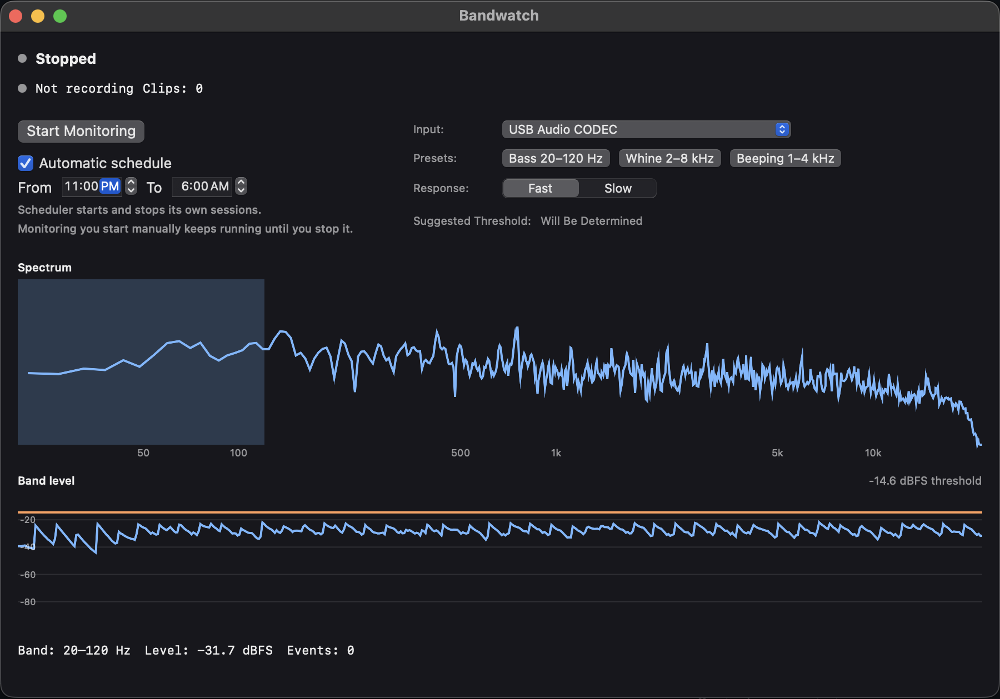
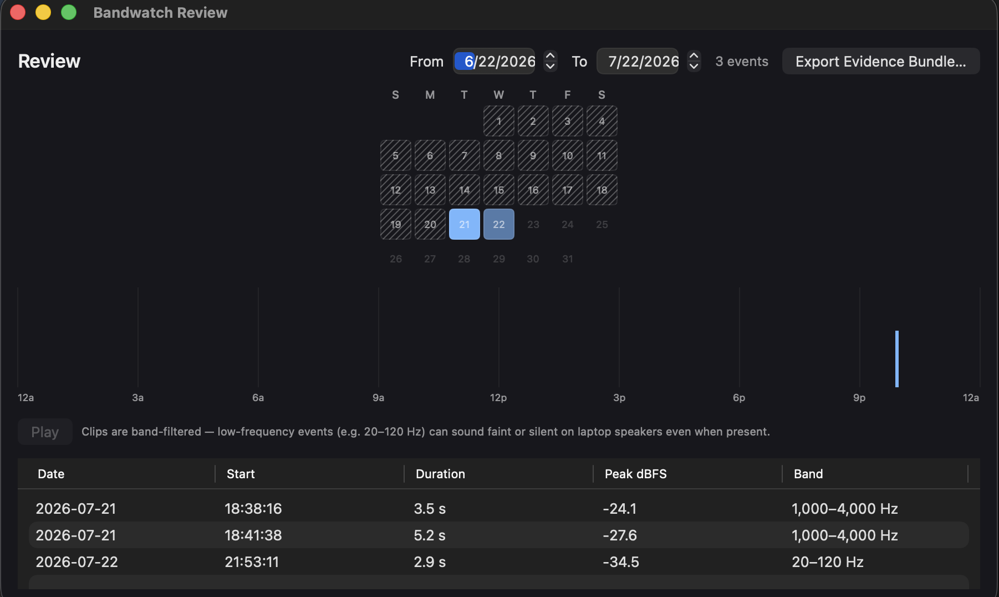
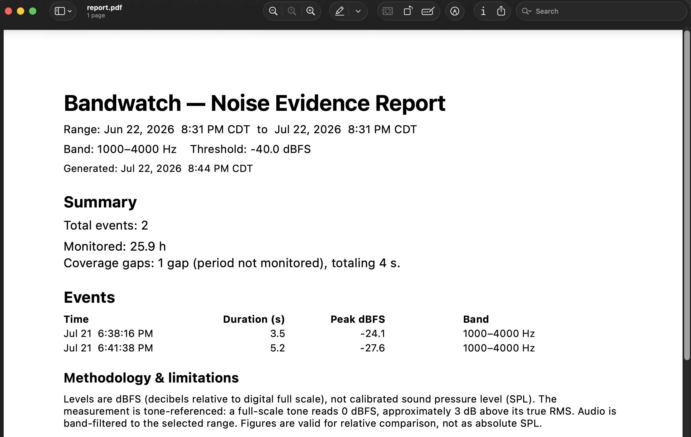

# Bandwatch

A native macOS app that watches a microphone for noise in a frequency band you
choose, records timestamped evidence of it, and exports a report you can hand to
a landlord, council, or mediator.



## What It Does

- **Live frequency analysis** — a real-time spectrum and a band-level meter, with
  Fast/Slow time weighting.
- **Drag to set the band and threshold** — target exactly the frequencies you
  care about (e.g. a subwoofer's 20–120 Hz).
- **Event detection** — automatically logs each time the band crosses your
  threshold, with peak/mean level, duration, and timestamp.
- **Recording** — saves a short band-filtered clip per event, with pre-roll.
- **Proven coverage** — records exactly when monitoring was running, so the
  report can prove "we were listening", not merely assume it.
- **Review** — a calendar heatmap, a 24-hour event ribbon, an event list, and
  clip playback.
- **Evidence export** — a paginated PDF report, CSVs, and the in-range clips,
  zipped into one bundle.





## How It Reads the Numbers (Honesty Notes)

Bandwatch documents the **pattern** of noise in a chosen frequency band — **when**
events happen, **how often**, **how long** they last, and their **relative**
loudness over time, each stamped with the input device that captured it. It is a
monitoring log, not a certified acoustic instrument:

- Levels are **dBFS, not calibrated SPL** — a relative digital scale, not a
  decibel reading you could cite as an absolute loudness. Establishing an
  absolute level (e.g. against a noise ordinance) needs a calibrated sound-level
  meter or a professional.
- The **equipment is not calibrated** — a consumer microphone/interface with
  uncharacterized sensitivity and low-frequency response (see *Choosing a
  Microphone* below).
- The **detection threshold is set by you** — an "event" is the in-band level
  crossing the threshold in effect at that moment, and each event stores the
  exact threshold that applied.
- Recorded audio is **band-filtered** — only frequencies inside the chosen band
  are kept. For a **low bass band** (e.g. a subwoofer's 20–120 Hz) this strips out
  the speech range, so those clips contain no intelligible speech. **A band that
  overlaps voice frequencies (roughly 300 Hz–3.4 kHz — including the 1–4 kHz and
  2–8 kHz presets) can capture clear, understandable speech**, so treat bundles
  from higher bands as potentially containing conversation before sharing them.
- Coverage is a **measured record** of when the recorder was running, not an
  inference.
- Bandwatch records **short per-event clips**, not continuous audio — only the
  moments that cross your threshold are kept.
- **Data is deleted only to avoid filling the disk.** When free space drops
  below a floor (default **10 GB**), Bandwatch reclaims space by deleting event
  clips and log entries older than a retention window (default **90 days**); if
  it still cannot free enough, it **stops recording and logs a gap** rather than
  writing onto a full disk. Deletion is triggered **only** by low disk space, so
  with ample free space nothing is removed. This window is a conservative
  placeholder, not tuned to measured disk usage — **back up your data if you are
  relying on it.**

## Choosing a Microphone

**The MacBook's built-in microphone is not reliable for band-filtered
monitoring.** Its aggressive noise suppression and voice-tuned processing
distort low-frequency content, so a real subwoofer rumble can read faint or
inconsistent. **Use a discrete microphone** — a USB mic, a lavalier, or an
audio interface — for trustworthy measurements. Pick it from the **Input**
menu on the main window.

## Build & Run

**Prefer a ready-to-run app?** Each [release](https://github.com/Dilcue/Bandwatch/releases/latest)
ships a prebuilt `Bandwatch.app` inside `Bandwatch-<version>-universal.zip` — a
universal (Apple Silicon + Intel), ad-hoc-signed build. Download it, unzip, and
follow the one-time Gatekeeper step in [DEPLOY.md](DEPLOY.md); no toolchain
needed.

To build from source instead, you need **macOS 15+** and a Swift 6.3+ toolchain.
No third-party dependencies — only Apple's system frameworks.

```bash
swift build
swift run Bandwatch
```

(This repository uses a swiftly-managed toolchain; if `swift` on your PATH is
older, activate your toolchain first.)

## License

MIT — see [LICENSE](LICENSE). © 2026 Chris Connar.
